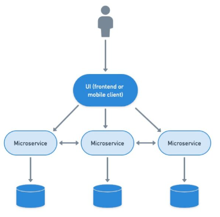
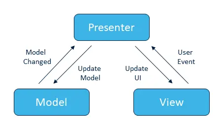

# Demo Project

This is a demo project showcasing JavaFX application development for an exercise to Mint SW

## Solution Architecture

The solution for the exercise is based on microservice architecture. Due to the simple nature of the exercise, it just includes a UI client based on JavaFX and 1 microservice in Spring Boot, communicating with a Postgresql DB.



Please, refer to the backend documentation to break down the api notes:
https://github.com/lcarlosrincon/mint-api/tree/develop

## Front architecture

The architecture for the frontend is based on MVP (Model-View-Presenter) pattern


## Prerequisites

- Java 17
- Maven

## Getting Started

1. Clone the repository:

```bash
git clone https://github.com/lcarlosrincon/mint-front-fx.git
   ```
   
2. Navigate to the project directory:
```
cd mint-front-fx
```

3. Build the project:
```
mvn clean install
```

4. Run the application:
```
mvn javafx:run
```

5. Dependencies
- JavaFX: JavaFX libraries for building rich client applications.
- Unirest Java: Lightweight HTTP client library.
- Gson: JSON serialization/deserialization library.

6- Project Structure
- src/main/java: Java source files.
- src/main/resources: Resources such as FXML files, CSS files, and image assets.
- src/test/java: Test source files.
- pom.xml: Maven project configuration file.
